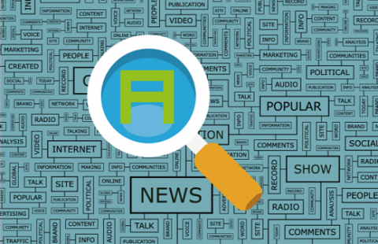

# IASC-2P02  Gavin Kirk

## Bio

  My name is Gavin Kirk, I am a third year Brock Interactive Arts and Science (IASC) student at Brock University. The IASC program is broken down into different streams and my focus has been on Digital Expression. My passion leans towards 3D modeling and after participating in an internship with a motion capture company I have started to direct my studies in that direction as well. I am also part of the Brock Badgers Mens Ultimate Frisbee Team which has been a great experience and something I like to do to unwind.

  My area of specialization in the digital humanities lies in data visualizations. I would like to continue with digital tools that help design and analyze text and graphic data. My current projects worked on two different things data visualization through hypercities and text analysis with reading machines. If I were to continue with this work, I would want to continue to develop a tool that blends both text analysis and data visualization. Words are sometimes difficult to understand but blending it with more visual detail like Voyant but taking it even further and mapping out books and their ideas seem like a valuable undertaking.

[Visual Portfolio](https://gk14jj.wixsite.com/portfolio)

## Featured Project

### Abstract

  In the academic blog post The Strength of Reading Machines, I aim to tackle the power of Reading Machines (Text Analysis Tools) using the debate in the Digital Humanities to present the argument that text analysis goes beyond just the English departments much like the Digital Humanities do. My approach begins with outlining reading machines by Stephen Ramsay. I present the area of debate that is the Digital Humanities are strongly rooted in the English department. I use a Voyant tool word breakdown to represent a gallery of data in which the text analysis tool is used and explain that it can be used in a variety of fields. Its powers goes beyond just English and is essential to a variety of scholarly purposes. I find that there hasn’t been a huge amount of text analysis done in areas such as math and science, but I propose that there could be more done using the tools. Text analysis tools do however show a very strong power in text-based areas and can be pushed further.

  The academic blog post started out rough in a variety of ways. The original can be found [here](https://github.com/gk14jj/IASC-2P02/commit/5ead4e1674aeea814c5a6ae2954d2173505e388d#diff-e95c7dc8eefee7d0e25121cd7f0007ae). I started off by rewriting the blog and cleaning it up. I reread the entire post and corrected any spelling and grammar errors I could see, as it was one of the main areas that my blog need to improve on based on instructor feedback. The first grammar and spell check can be found [here](https://github.com/gk14jj/IASC-2P02/commit/e453ec7ce818faf19676c20d5eb3c9c6854be1b2#diff-e95c7dc8eefee7d0e25121cd7f0007ae). After the original writing corrections, I decided to tackle another area where the academic blog could improve based on instructor feedback. I had issues fitting some of my arguments together and balancing them out. The abstract at the beginning of this page presents the argument better. I went back to the blog and added new sections in the conclusion as well as formatted in better. I also added some introduction changes and other sentence changes throughout the work to create a more coherent post and thesis argument. The final changes can be found [here](https://github.com/gk14jj/IASC-2P02/commit/e3062ce3938ba72ab246a08e0c4073f451598966#diff-e95c7dc8eefee7d0e25121cd7f0007ae) among another final edit regarding formatting, spelling, and grammar. 

The Strength of Reading Machines... [continue reading](blog.md)

## Collaborative Project

### Project Description
  Team 4 consisted of Gavin K, Zach K, Anna L, and Jimmy M. We selected HyperCities to research and present. HyperCities is a tool used to create digital maps in the digital humanities. These maps can have a variety of purposes but usually involve creating data and locating them spatially throughout history, almost like a time travel machine for information. Our team couldn’t produce anything to impressive but we were able to create overlay a New York City population map on top of google earths current New York City. Our research findings concluded that HyperCities was a very complex tool but with the correct training or practice could create dynamic learning environments for the digital humanities.

### Collaborative Statement

  Our approach as a team started out with general information gathering and sharing. I was able to gather different links and data that would assist all members in their project portion. The link [here]( https://github.com/IascAtBrock/IASC-2P02-TeamPresentations/commit/cb4d8f32c7ca619d0689f9cb1d751c5e7fca0c29#diff-6041f7d1583cceb2e01d25b510bab0c4) is an example of one of the later commits that added new links for the team to pull information from. After we create the general information section the team divided the research and presentation up into sections. I was in charge of using HyperCities and create something using the tool. I was also put in charge of explaining the overall usability. The usability slide is shown below.

1

The pictures I uploaded to the teams GitHub page are shown [here](https://github.com/IascAtBrock/IASC-2P02-TeamPresentations/commit/3c1d4a2c65103b2e8b3b05f78442ab470939bae4#diff-a61126a826955ad27bba21faa5986499). These pictures were used in the presentation and show the map overlay I created and the detailed forked file I tried to use to create a more advance HyperCities map. Unfortunately the forked library was too advanced for me.

  Our collaborative approach was working together for information gathering and then separating the large project into piece that could be tackle by individuals with collaboration during the section development. Working as a team is an effective way to approach the Digital Humanities because the concepts can be vast at points and having a number of people trying to understand is a useful venture. GitHub was a useful too but we found ourselves using google slides and Facebook for communication as the GitHub interface was new to us and kind of confusing to start. GitHub was useful to share links and upload files and images to be backup.

## Academic Blog 

The Strength of Reading Machines... [continue reading](blog.md)

## Research Presentation

[click here] Paste final url for slides

